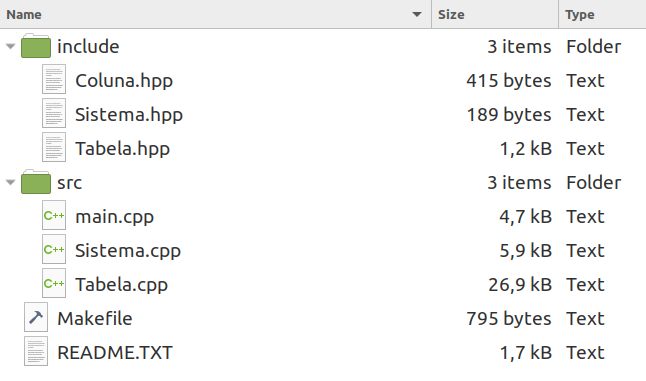
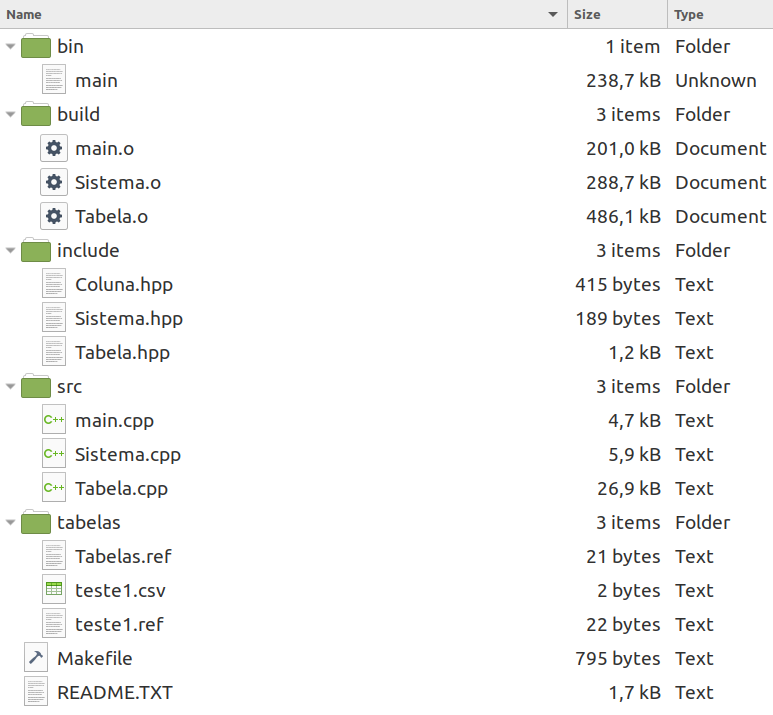

## Visão Geral do Projeto

- Nosso projeto é um _sistema de gerenciamento de banco de dados simplificado_ baseado no modelo relacional, escrito em **C++** e feito para compilar em sistemas **Linux**.

### Funcionalidades

- Nosso sistema conta com as seguintes funcionalidades, baseadas no projeto modelo definido pelo professor:

```markdown
Bem vindo!
Qual operação deseja realizar?
[1] Criar Tabela
[2] Listar Tabelas Existentes
[3] Visualizar Tabela
[4] Adicionar Nova Linha em uma Tabela
[5] Realizar Pesquisa numa Tabela
[6] Excluir Elemento de uma Tabela
[7] Excluir uma Tabela
[8] Finalizar Operação
```

### Criar Tabela

- Ao selecionar a opção [1], o usuário será requisitado de algumas informações para criação de uma nova tabela, como consta abaixo.

```
Insira o nome da Tabela a ser criada:
teste1									<-- Entrada do usuário
Insira o numero de colunas que deseja ter na Tabela:
3									<-- Entrada do usuário
Insira o nome da coluna 1: int_col
Qual o tipo da coluna?
[0] char
[1] int
[2] float
[3] double
[4] string
1			<-- Entrada do usuário
Deseja fazer dessa a sua chave primária?
[0] Sim[1] Não
0									<-- Entrada do usuário
Insira o nome da coluna 2: float_col
Qual o tipo da coluna?
[0] char
[1] int
[2] float
[3] double
[4] string
2									<-- Entrada do usuário
Insira o nome da coluna 3: char_col	<-- Entrada do usuário
Qual o tipo da coluna?
[0] char
[1] int
[2] float
[3] double
[4] string
0									<-- Entrada do usuário
Tabela 1 Criada!
Digite uma entrada qualquer para continuar.
```

### Listar Tabelas Existentes

- Ao selecionar a segunda opção, o usuário poderá visualizar todas as Tabelas existentes no sistema:

```
Lista de tabelas existentes:
-- teste1
-- teste2
-- teste3
Digite uma entrada qualquer para continuar.
```

### Visualizar Tabela

- Esta função permite visualizar todos os dados de uma Tabela existente.

```
Lista de tabelas existentes:
-- teste1
-- teste2
-- teste3
Qual tabela deseja visualizar?
```

### Adicionar Nova Linha em uma Tabela

- A função [4] irá iniciar o procedimento para adicionar uma nova linha, perguntando o valor que deve ser atribuído para cada célula.

```
Lista de tabelas existentes:
-- teste1
-- teste2
-- teste3
Em qual tabela deseja adicionar uma nova linha?
```

### Realizar Pesquisa numa Tabela

- Permite encontrar valores específicos numa Tabela.

```
Lista de tabelas existentes:
-- teste1
-- teste2
-- teste3
Em qual tabela deseja realizar a pesquisa?
```

### Excluir Elemento de uma Tabela

- Remove o conteúdo de uma célula específica.

```
Lista de tabelas existentes:
-- teste1
-- teste2
-- teste3
Em qual tabela deseja excluir um elemento?
```

### Excluir uma Tabela

- Deleta a tabela selecionada do disco e dos registros.

```
Escolha uma tabela para ser excluída:
[0] - teste1
[1] - teste2
[2] - teste3
0									<-- Entrada do usuário
tabelas/1.csv <- Arquivo removido com sucesso.
tabelas/1.ref <- Arquivo removido com sucesso.
Digite uma entrada qualquer para continuar.
```

### Finalizar Operação

- Encerra os procedimentos e salva em disco todas as alterações realizadas.

# O Programa

## Estrutura de Pastas, Compilação e Execução

- A organização de pastas do projeto seguiu o padrão src include, que separa os arquivos de código-fonte e de cabeçalho.



- Após o comando `user@pc:~/SGBDR$ make`, as pastas auxiliares ./build, ./bin e ./tabelas são criadas para conter os arquivos de build e os binários de execução, respectivamente.
- No exemplo abaixo podemos ver que ./tabelas possui alguns arquivos, eles foram criados no momento em que a Tabela teste1 foi salva. Tabelas.ref é um arquivo de referência contendo os nomes das Tabelas presentes no sistema. Arquivos teste1.csv e teste1.ref foram criados junto com a Tabela e são respectivamente o arquivo de tabela e sua referência, que contém sua chave primária, a quantidade de colunas e o nome de cada coluna.



- Após o comando make ser executado, o programa pode ser iniciado com o comando `user@pc:~/SGBDR$ ./bin/main`.

### Observações

- Para que as alterações realizadas no sistema sejam salvas em disco, é necessário finalizar a operação utilizando a função [8].
- Não é possível, por exemplo, criar uma Tabela e excluí-la logo em seguida, pois o arquivo em disco ainda não foi gerado.
- O arquivo Makefile conta com o comando `user@pc:~/SGBDR$ make clean`, porém deve-se avisar que o mesmo limpa também a pasta de arquivos gerados pelo próprio programa (./tabelas), excluindo as tabelas e referências. Use apenas quando os arquivos não forem mais necessários.

## Código

### Tabela.hpp
```cpp
#ifndef __TABELA__H__
#define __TABELA__H__

class Tabela
{
private:
	string Nome_da_Tabela;
	string Nome_Coluna_Primaria;
	int Total_Linhas;
	vector<int> Chaves_Primarias;
	vector<int> Chaves_Estrangeiras;
	vector<Coluna> Colunas;
public:
	void Acrescentar_Coluna(string Nome_da_Coluna, int Tipo_da_Coluna);
	string getNome_da_Tabela();
	void setNome_da_Tabela(string Novo_Nome);
	Tabela();
	Tabela(string Novo_Nome, string Novo_Coluna_Primaria, int Novo_Total_Linhas);
	void Adicionar_Linha();
	void Registrar_Tabela();
	void Listar_Dados();
	void Pesquisa();
	void Receber_Colunas(vector<Coluna> Novas_Colunas);
	void Receber_Coluna_Primaria(vector<int> Nova_Coluna_Primaria);
	void Remover_Elementos();
};

#endif
```

### Sistema.hpp
```cpp
#ifndef __SISTEMA__H__
#define __SISTEMA__H__

void Listar_Tabelas();
Tabela *Extrair_Tabela(string Nome_da_Tabela);
void Excluir_Tabela();

#endif
```

### Coluna.hpp
```cpp
#ifndef __COLUNA__H__
#define __COLUNA__H__

typedef struct COLUNA
{
	string Nome_da_Coluna;		 //Nome da coluna em questão
	int Tipo_da_Coluna;			 //Tipo da coluna em questão
	vector<char> Elementos_char; //Vetor dos elementos contidos na coluna
	vector<int> Elementos_int;
	vector<float> Elementos_float;
	vector<double> Elementos_double;
	vector<string> Elementos_string;
} Coluna;

#endif
```
